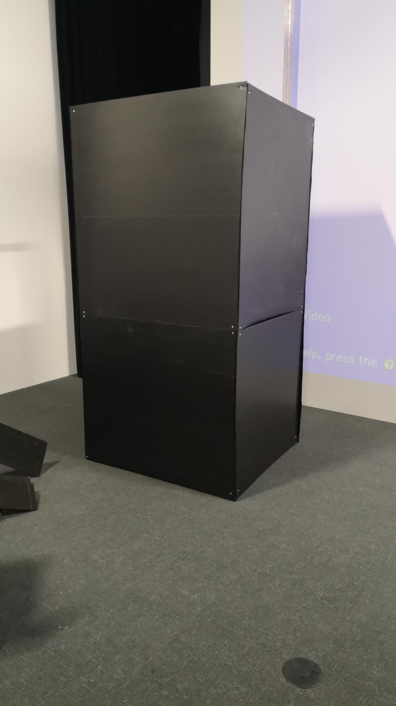
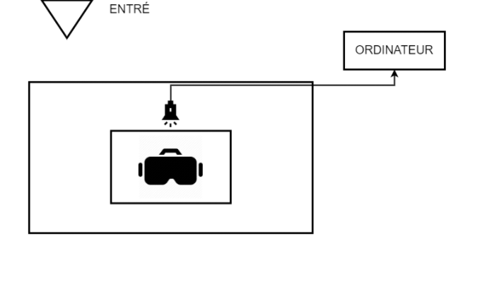

# 3 minutes

**Réalisé par :** Naoufal Bensaiad, Jérémie Lévesque et Samuel Poulin

**L'installation en cours** 

 
 
 *Source : Page du projet 3 minutes*

**L'installation prévue** 

 
 
*Source : Github du projet 3 minutes*

---

## Thème : Le temps

**Comment le thème est-il exploité ?** : Le thème est exploité en comparant deux situations qui durent trois minutes. Malgré qu'elles durent le même temps, notre notion du temps est différente lorsque l'on vit différentes situations.

**L'ambiance :** Il y a une ambiance joyeuse ainsi qu'une ambiance angoissante.

**Ce qui est attendu de l'interacteur.trice lors de l'expérience :**  Il est attendu que l'interacteur.trice expérience la première situation avec énergie en essayant de jouer au ballon chasseur et lorsque l'on s'amuse, le temps semble s'écouler plus rapidement. Par la suite, en allant dans la deuxième situation étant dans un endroit sombre et clos, l'interacteur.trice ressent un sentiment d'angoisse ainsi que de malaise.

---

## Cours incontournables pour créer ce projet

1. Conception sonore
2. Réalité virtuelle
3. Modélisation 3D

