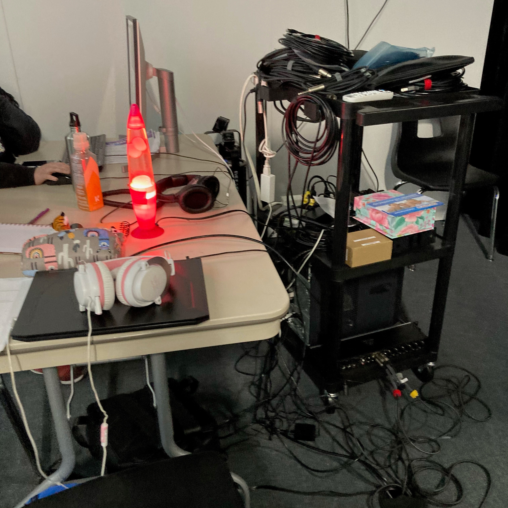
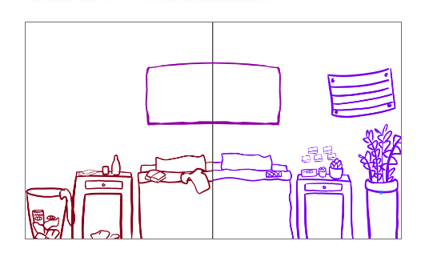

# Chère Sasha

**Réalisé par :** Trish Nguyen, Angelina De Silva Jeca, Karine Cormier et Sabrina Kayani

**L'installation en cours** 

 

**L'installation prévue** 

 

*Source : Scénarimage - Github du projet Chère Sasha*

---

## Thème : Le temps

**Comment le thème est-il exploité ?** : Le thème du temps est exploité en nous faisant découvrir le point de vue d'une personne, mais à deux moments différent de sa vie. Cela fait remarquer que le temps présent ne détermine pas notre temps futur.

**L'ambiance :** Il y a une ambiance sombre et triste ainsi qu'une ambiance plus légère et joyeuse.

**Ce qui est attendu de l'interacteur.trice lors de l'expérience :** Il est attendu que l'interacteur.trice observe, écoute et intéragit avec les objets de la chambre pour pouvoir en apprendre plus sur la vie à Sasha.

---

## Cours incontournables pour créer ce projet

1. Programmation interactive et bases de données
2. Programmation serveur web
3. Conception sonore

