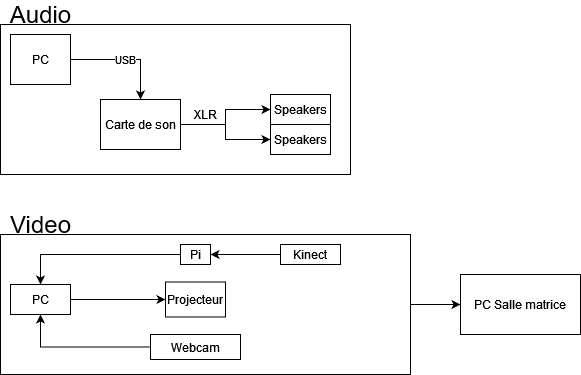
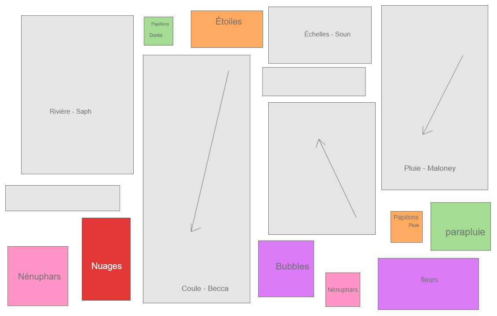

# Titre du projet
Chronaufrage

**Réalisé par :** Émilie Fontaine, Maloney Khim, Sounthida Kong, Olivier Lalonde et Rebecca Pilotte

**L'installation en cours** 

*Source : https://tim-montmorency.com/2022/projets/Chronaufrage/docs/web/preproduction.html*

**L'installation prévue** 

Schéma branchement

Plan technique

Ultrawide nofocus

Ultrawide projecteur

Plan

*Source : https://tim-montmorency.com/2022/projets/Chronaufrage/docs/web/preproduction.html*

---

## Thème : Le temps

**Comment le thème est-il exploité ?** :

**L'ambiance :**
Ambiance sonore : Une musique calme, mystérieuse, mélancolique. Des effets sonores d'eau (pluie, rivières, chutes)
Ambiance générale : monde de fantaisie, de l'imagination, style féerique.

**Ce qui est attendu de l'interacteur.trice lors de l'expérience :**
Comprendre les impacts de la société sur quelqu'un.

---

## Cours incontournables pour créer ce projet

1. Conception sonore
2. Modelisation 3D
3. Animation 2D

