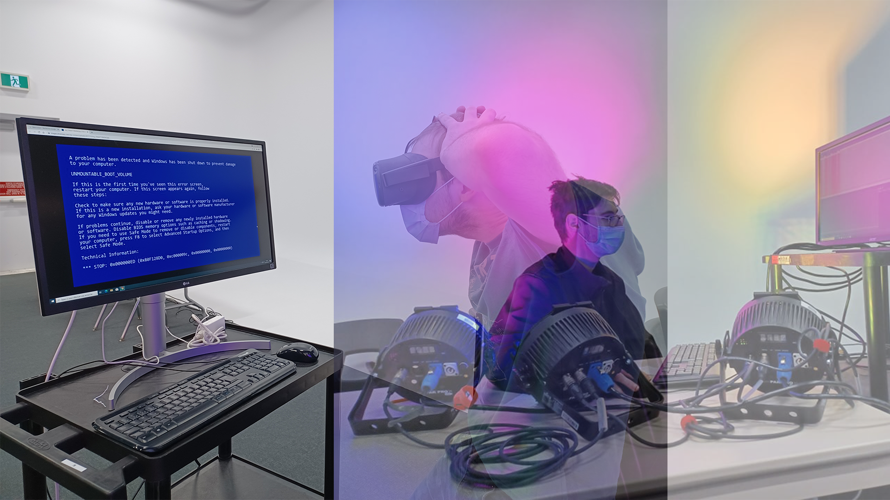

# Titre du projet
Distortion collective

**Réalisé par :** William Dubois et Ghislain Lacombe

**L'installation en cours** 

*Source : https://tim-montmorency.com/2022/projets/Distorsion-collective/docs/web/preproduction.html*

**L'installation prévue** 

Plan du projet

Storyboard (1 à 3)

*Source : https://tim-montmorency.com/2022/projets/Distorsion-collective/docs/web/preproduction.html*

---

## Thème : Le temps

**Comment le thème est-il exploité ?** :

Le projet est présente un élève qui fait des ours en ligne, en plein milieu de la Covid-19, en confinement. Au début, il semble être heureux de la situation, mais plus le temps avance, plus il vit un sentiment d'isolement. Cette situation qui ne fait que s'agraver fini par affecter sa santé mental et malheureusement, il est coincé dans cette boucle.  

**L'ambiance :**

Comme ambiance  générale, on se trouve dans une maison normale. La chambre de l'adolescent est en désordre. Les autres pièces de la maison comme la cuisine et le salon sont assez pleines, rien d'extraordinaires. De plus, au début du projet on retrouve une musique plus relaxante et vers la fin, on retrouve une musique plus stressante.  

**Ce qui est attendu de l'interacteur.trice lors de l'expérience :**

L'interacteur.trice devra réfléchir aux conséquences que la pandémie, l'isolement et les cours en ligne ont sur la santé mentale des jeunes. Par exemple : difficultés sociales et scolaires.

---

## Cours incontournables pour créer ce projet

1. Modélisation 3D
2. Animation 2D
3. Conception sonore

