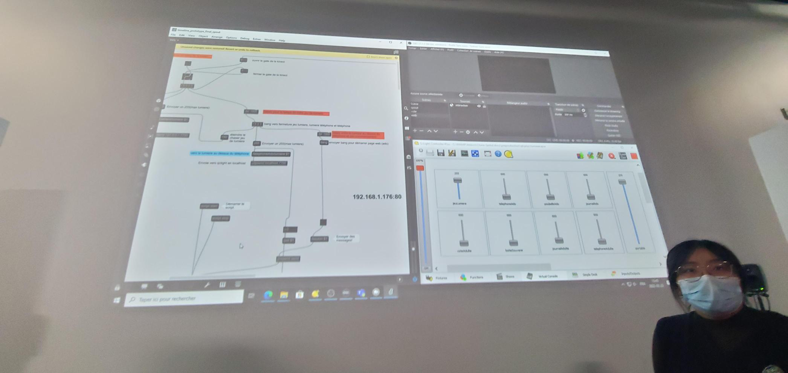
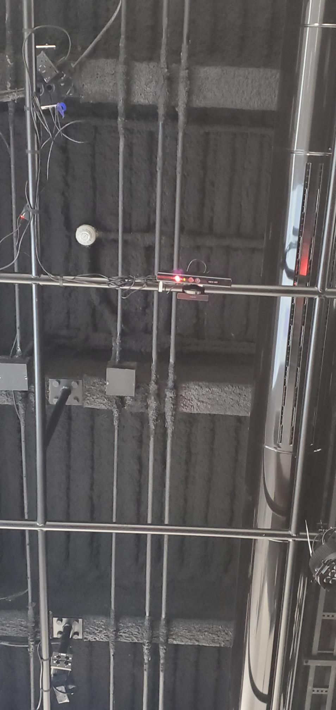

## Technique

Dans le projet Chère Sasha, on ne connait pas le logiciel **Max** qui fut utiliser pour contrôler le sons et les effets sonores à travers le projet.

 

## Composante technologique

Dans le projet Chère Sasha, on ne connaissait pas la composante technologique **Kinect** qui a été utilisé pour ce projet. En faisait des recherches nous avons compris qu'elle servait à détecter les mouvements des personnes près d'elle.

 

